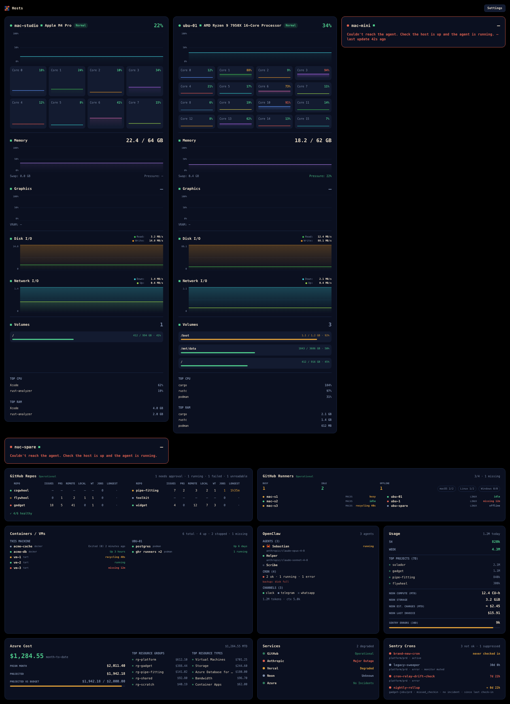
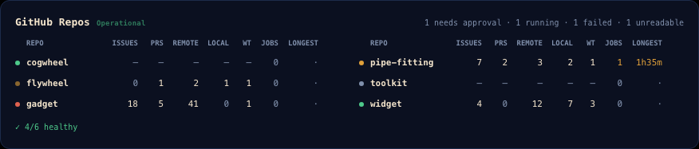
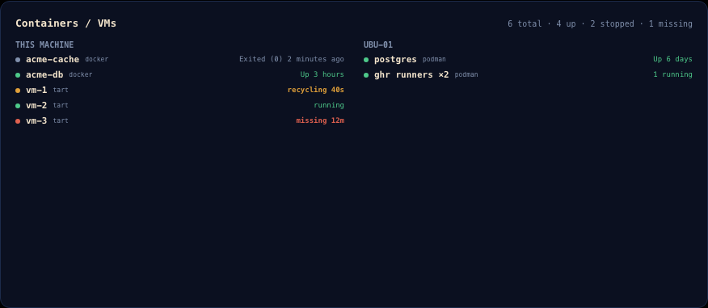
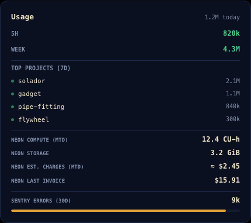
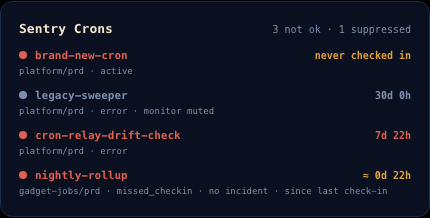
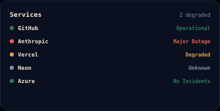
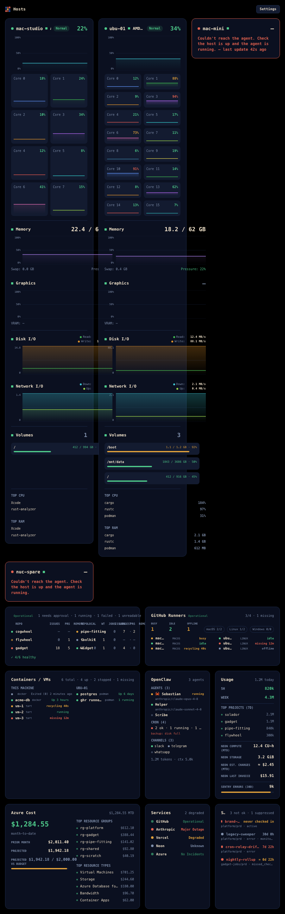

# Solador

A cockpit for everything around your code — machines, CI, containers, spend,
vendor status, agents — read at a glance from a second monitor.

*Solador* is Spanish for **tiler**: the tradesperson who lays tiles. The cockpit
is a grid of tiles; this is what arranges them.



Runs on **macOS and Windows**.

## Is this for you?

Probably not, and it's cheaper to say so here than after you've cloned it.

Solador is opinionated about a specific stack. It is most useful if you run
several repos on **GitHub Actions**, keep machines you reach over **Tailscale**,
and pay **Neon, Sentry, Vercel or Azure**. Every panel is independent and
degrades to a setup line when unconfigured, so you can use two of nine — but if
none of that describes you, there is not much here.

It is also **not a monitoring product**. There are no alerts, no history beyond
what fits on screen, no retention, no server. It is a window you leave open.

## What it shows

| Panel | Reads |
|---|---|
| **Hosts** | CPU, memory, disk, network, GPU, battery — this machine plus any host running the [agent](agent/) |
| **Containers / VMs** | docker, podman and tart, locally and on every host |
| **GitHub Repos** | running workflows, longest-running elapsed, branch and worktree counts |
| **GitHub Runners** | your org's self-hosted runners, with an absence roster |
| **Usage** | Claude Code token rollups, plus Neon, Sentry and Vercel consumption |
| **Azure Cost** | the daily cost export, month to date |
| **Sentry Crons** | every cron monitor that is not `ok`, and **how long it has been broken** |
| **Services** | availability for GitHub, Anthropic, Vercel, Neon and Azure |
| **OpenClaw** | an agent farm, over a live WebSocket |

<details>
<summary>Individual panels</summary>

| | |
|:--:|:--:|
|  |  |
|  |  |
|  |  |

At a narrower width the layout reflows rather than scrolling:



</details>

## The one design rule

**Unknown is representable, and it is never rendered as zero.**

Every value a producer might fail to measure is optional the whole way down —
an absent key decodes to nothing, and `0` means *measured zero*. A dash is a
dash:

- `—` means nobody could find out.
- A dimmed `0` means there are genuinely none.
- `≈` with an amber tint means the figure is inferred, not observed.
- An empty green panel is treated as a **bug**, because a panel that has never
  successfully read anything looks identical to one where all is well.

Most of the fiddly code here exists to keep those apart. If you only take one
idea from this repository, take that one.

## No telemetry

The app carries **no crash-reporting or analytics SDK of any kind**. The only
thing it sends anywhere are the API calls you configure, with your own
credentials, to the vendors you chose. Credentials live in your OS credential
store, never in the settings file.

## Running it

There are **no binaries yet** — see [Status](#status). Build from source:

```bash
git clone https://github.com/cpmadrid/solador
cd solador
./dev            # build and run (debug)
./dev run --release
```

You'll need a recent stable Rust toolchain (pinned by `rust-toolchain.toml`) and
Node 22 for the frontend test suite.

Nothing is configured on first launch: no repos, no hosts, no credentials. Each
panel tells you what it wants. Open **Settings** and add what you care about.

| To get | Give it |
|---|---|
| Repos | a fine-grained GitHub PAT with read access to Actions, Contents, Issues and Pull requests |
| Runners | the same token, plus your **GitHub organization** |
| Hosts | the [agent](agent/) on each machine, and its bearer token |
| Usage / Cost | a Neon org key, a Sentry `org:read` token, a Vercel token, an Azure Cost SAS URL |

## Two apps in one repository

Worth knowing before you go looking:

- **`app/` + `crates/`** — the Tauri app. This is Solador, and it is what ships.
- **`DevCanopy/`** — a complete SwiftUI application, **frozen**. It was the
  original macOS-only version and is kept as a parity reference. It is not
  built, tested or linted in CI, and it may not even compile. Changes land in
  the Rust app; Swift pull requests will not be accepted.

The Swift tree is large enough that finding it unexplained costs an hour.

## Layout

```
app/src-tauri/   Tauri shell: one poll task per panel, plus the settings surface
app/ui/          Frontend — plain HTML/CSS/JS, no bundler
crates/          The real work: viewmodel, store, github, usage, azurecost,
                 servicestatus, openclaw, localhost, wire, agentclient
agent/           The per-host metrics agent (its own workspace and CI job)
tests/frontend/  Playwright suite for app/ui
DevCanopy/       The frozen Swift app
```

Every string and colour a panel paints is decided in Rust and published to the
frontend. The frontend lays out; it does not invent labels.

## Development

```bash
./dev test        # cargo test --workspace + the Playwright suite
./dev lint        # fmt + clippy, exactly what CI runs
./dev format      # fix formatting
```

`./Scripts/install-hooks.sh` wires lint to a pre-push hook.

Screenshots in this README are generated, not captured:

```bash
cd tests/frontend && npm run screenshots
```

They render the real frontend against the same fixtures the tests assert on, so
they cannot drift from the shipped palette.

## Status

Early. It runs every day on the author's desk, which is a different claim from
*finished*:

- **No signed builds.** macOS Gatekeeper will block an unsigned app, so today
  the practical audience is people willing to build it themselves.
- **No releases**, and therefore no upgrade path.
- The Tauri IPC boundary has no automated coverage; `app/README.md` carries a
  manual smoke checklist that is the only thing exercising it.

## Contributing

See [CONTRIBUTING.md](CONTRIBUTING.md). Security reports: [SECURITY.md](SECURITY.md).

## License

[Apache-2.0](LICENSE).
