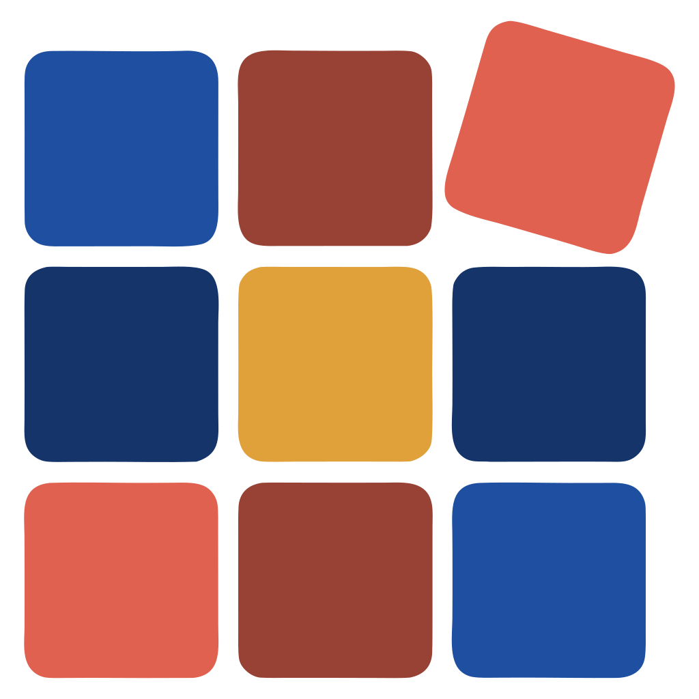
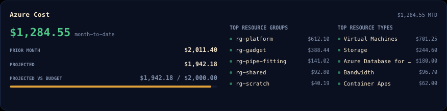
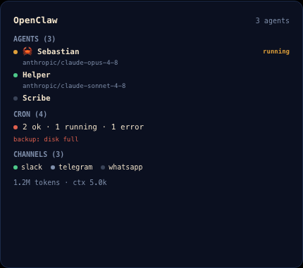

# Solador

A cockpit for everything around your code — machines, CI, containers, spend,
vendor status, agents — read at a glance from a second monitor.

<br clear="left">


The mark is a tiler's 3×3 grid with **one tile out of true**, and the name is
Spanish: *solar* — to floor, to pave, to tile — plus *-dor*, the tradesperson
who lays them. The odd tile is the whole point. A grid where everything is
square says nothing; what you want from a wall of panels is to notice the one
thing that isn't right.

---

## Download

**[Get the latest release →](https://github.com/Sassy-Dog/solador/releases/latest)**

| Platform | You want | Notes |
|---|---|---|
| **macOS 14+** | `Solador-<version>.dmg` | Universal — Apple silicon and Intel. Signed, notarized and stapled, so it opens without a Gatekeeper argument. Checks for an update on launch and never installs one behind your back. |
| **Windows 10/11** | `Solador_<version>_x64-setup.exe` | x64, Authenticode-signed. **No update channel yet** — the app says so plainly rather than reporting a failed check, and you install the next one over it. |
| **Linux** | — | No cockpit build. Linux runs the [agent](agent/), which is how a Linux box appears in someone else's cockpit. |

Prefer to build it yourself? See [Build from source](#build-from-source).
Windows 10 also needs the WebView2 runtime; Windows 11 already has it.

## What you get right away

Open it and it does something useful immediately. No account, no sign-up, no
server, no token, nothing to configure first:

- **This machine** — per-core CPU, memory, disk and network rates, GPU and
  battery, sparklined at 1 Hz.
- **Your containers** — whatever `docker`, `podman` or `tart` you already run.
- **Vendor status** — GitHub, Anthropic, Vercel, Neon and Azure, read from their
  public status pages, with a desktop notification when one changes in either
  direction (on by default, and easy to turn off).
- **Your Claude Code usage** — token rollups folded up from the logs already on
  your disk. No key, no account, nothing leaves the machine.

Everything after that is opt-in, one credential at a time. A panel you haven't
set up shows a muted line saying what it wants — never a red error. *Setup is
not failure*, and the code says so in as many words.

## What it shows

Nine panels. Every one is independent, so using three of them is a perfectly
normal way to run this.

| Panel | Reads |
|---|---|
| **Hosts** | CPU, memory, disk, network, GPU, battery — this machine, plus any host you can reach that runs the [agent](agent/) |
| **Containers / VMs** | docker, podman and tart, locally and on every host |
| **GitHub Repos** | running workflows, longest-running elapsed, branch and worktree counts |
| **GitHub Runners** | your self-hosted runners, with an absence roster for the ones that should be there and aren't |
| **Usage** | Claude Code token rollups, plus Neon, Sentry and Vercel consumption |
| **Azure Cost** | the daily cost export, month to date |
| **Sentry Crons** | every cron monitor that is not `ok`, and **how long it has been broken** |
| **Services** | availability for GitHub, Anthropic, Vercel, Neon and Azure |
| **OpenClaw** | an [OpenClaw](crates/openclaw/) agent farm, over a live WebSocket — the one panel that is event-driven rather than polled |

<details>
<summary>See the panels up close</summary>

| | |
|:--:|:--:|
|  |  |
|  |  |
|  |  |
|  |  |

At a narrower width the layout reflows rather than scrolling, and you can
rearrange the panels per width band in Settings → Layout:


</details>

## Connect what you care about

Add these in **Settings**, in any order, whenever you feel like it.

| To see | Give it |
|---|---|
| **Repos and Runners** | a fine-grained GitHub token, read-only on Actions, Contents, Issues and Pull requests. It finds your repos itself, and derives the organizations whose runners it watches — [step-by-step walkthrough](docs/github-setup.md) |
| **Other machines** | the [agent](agent/) running on that host, plus its address and bearer token |
| **Usage** | a Neon org key, a Sentry `org:read` token, a Vercel token — each optional and independent |
| **Azure Cost** | a daily cost export in blob storage. There is no credential to paste: it signs each read itself with the `az` CLI you're already signed in to |
| **Sentry Crons** | the same Sentry token as above — one credential, two panels |

**On reaching other machines:** the cockpit speaks plain HTTP to a host and a
port, so **any network path works** — a LAN, a VPN, WireGuard, ExpressRoute,
Tailscale, an SSH tunnel. It does not care how the packets get there. The agent
itself binds a private address by default rather than `0.0.0.0`, so installing
it doesn't quietly publish your metrics to the internet; set `SOLADOR_AGENT_BIND`
if you want it somewhere else. See [`agent/README.md`](agent/README.md).

## The one design rule

**Unknown is representable, and it is never rendered as zero.**

Every value a producer might fail to measure is optional the whole way down — an
absent reading decodes to nothing, and `0` means *measured zero*. A dash is a
dash:

- `—` means nobody could find out.
- A dimmed `0` means there are genuinely none.
- `≈` with an amber tint means the figure is inferred, not observed.
- An empty green panel is treated as a **bug**, because a panel that has never
  successfully read anything looks identical to one where all is well.

If you only take one idea from this repository, take that one.

## Your data stays yours

**No telemetry, no analytics, ever.** Nothing is collected about how you use it.

**Crash reporting is off until you turn it on** in Settings → General. With it
off there is no client, no panic hook and no network path at all. Turn it on and
a crash is rebuilt from an allow-list of named fields before it leaves: host
addresses, host names, tokens, absolute paths, source lines and local variables
are not on that list.

**Credentials live in your OS credential store** — Keychain on macOS, Credential
Manager on Windows — never in the settings file. Apart from the vendors you
configure, with your own credentials, the app talks to nothing.

More detail in [SECURITY.md](SECURITY.md) and [docs/SECRETS.md](docs/SECRETS.md).

## Feedback

**This is the part I'd most like help with.** Solador has been shaped by one
stack, and the fastest way for it to become useful to more people is to hear
where it doesn't fit yours.

The single most useful thing you can tell me: **did you leave it open?** If it
earned a spot on your second monitor, which panels did the earning? If you
bounced off it, where — the download, the first launch, a panel that wanted a
credential you didn't want to create?

- **[Start a discussion](https://github.com/Sassy-Dog/solador/discussions)** —
  impressions, questions, a screenshot of your own cockpit, or an idea you
  haven't shaped into a request yet. No template, no ceremony.
- **[Open an issue](https://github.com/Sassy-Dog/solador/issues/new/choose)** —
  something's broken, or you have a concrete request. There's a **Feedback**
  template with no repro steps to fill in, if a bug report feels like the wrong
  shape for what you want to say.
- **Want a panel, or a vendor, that isn't here?** Say so. Panels are deliberately
  self-contained, so "watch X at a glance" is a tractable request rather than a
  rewrite.

Worth knowing up front, so nobody writes a proposal that was never going to
land: **alerting, history and retention, and anything requiring a server are
deliberately out of scope.** This is a window you leave open, not a monitoring
product. That boundary is what keeps it free of accounts, agents-as-a-service
and a bill.

## Contributing

Contributions are welcome, and [CONTRIBUTING.md](CONTRIBUTING.md) is written to
make a first PR straightforward: the dev loop, what CI runs, and the four
conventions here that are load-bearing rather than stylistic — chief among them
that **nothing may fabricate a value to fill a gap**.

A clean clone needs no credentials at all to build, run or test. Security
reports go through [SECURITY.md](SECURITY.md) rather than the issue tracker.

## Build from source

```bash
git clone https://github.com/Sassy-Dog/solador
cd solador
./dev                  # build and run (debug)
./dev run --release
```

You need [Rust via rustup](https://rustup.rs) — don't pick a version,
`rust-toolchain.toml` pins one and rustup installs it with `rustfmt` and
`clippy` on your first `cargo` run. On macOS you also need the Xcode Command
Line Tools (`xcode-select --install`; full Xcode is *not* required). On Windows,
the MSVC C++ Build Tools, plus the WebView2 runtime on Windows 10.

```bash
./dev test             # cargo test --workspace, plus the Playwright suite
./dev lint             # fmt + clippy — exactly what CI runs
./dev format
```

`./scripts/install-hooks.sh` wires lint to a pre-push hook.
[CONTRIBUTING.md](CONTRIBUTING.md) has the full table and the rationale.

Optional tools that simply make panels show more: `docker`, `podman` or `tart`,
and the Azure CLI. Every one of them is absent-tolerant — a missing tool makes
its panel say so, not crash.

<details>
<summary>How the code is laid out</summary>

```
app/src-tauri/   Tauri shell: one poll task per panel, plus the settings surface
app/ui/          Frontend — plain HTML/CSS/JS, no bundler
crates/          The real work: viewmodel, store, github, usage, azurecost,
                 servicestatus, openclaw, localhost, wire, agentclient
agent/           The per-host metrics agent (workspace member, Linux CI job)
tests/frontend/  Playwright suite for app/ui
tests/fixtures/  Wire-contract fixtures both agent/ and crates/ assert against
```

Every string and colour a panel paints is decided in Rust and published to the
frontend. The frontend lays out; it does not invent labels. The Tauri shell is
thin on purpose, so panels are testable without a UI —
[`app/README.md`](app/README.md) is the reference for the shell itself.

Screenshots in this README are generated, not captured
(`cd tests/frontend && npm run screenshots`). They render the real frontend
against the same fixtures the tests assert on, so they cannot drift from the
shipped palette.

</details>

## Status

It ships, it's signed, and it runs all day — and it is still young.

**Working today:** signed and notarized universal macOS builds, a signed Windows
installer, an update check on macOS, and all nine panels.

**Rough edges, stated plainly:**

- **Windows has no update channel.** The app tells you that instead of
  pretending a check failed; you install the next release over the current one.
- **Linux runs the agent, not the cockpit.**
- **Adding your own status vendor is half-landed.** Settings will accept a
  status page, probe it and store it, but the Services panel still watches
  only the five vendors above — the last wiring step never shipped
  ([#375](https://github.com/Sassy-Dog/solador/issues/375)). If you want a
  vendor watched, say so there and it moves up the list.
- **The Tauri IPC boundary has no automated coverage.** That is a decision, not
  an oversight: `tauri-driver` has no macOS support, so the only automatable
  host would be the Windows CI job — a large harness covering one build path.
  [`app/README.md`](app/README.md) carries the manual smoke checklist that
  covers it instead, along with a dated log of every run.

## License and the name

The code is **[Apache-2.0](LICENSE)**.

The Solador **name and mark are not** — Apache-2.0 §6 grants no trademark
rights. Use them to *refer* to Solador freely: a blog post, a comparison, a
talk, a package that integrates with it. Just don't put the mark on a fork, a
modified build, or a product of your own.

> Forks are welcome and the license permits them — just ship them under your own
> name.

Full terms, and the mark itself, in [brand/README.md](brand/README.md).
